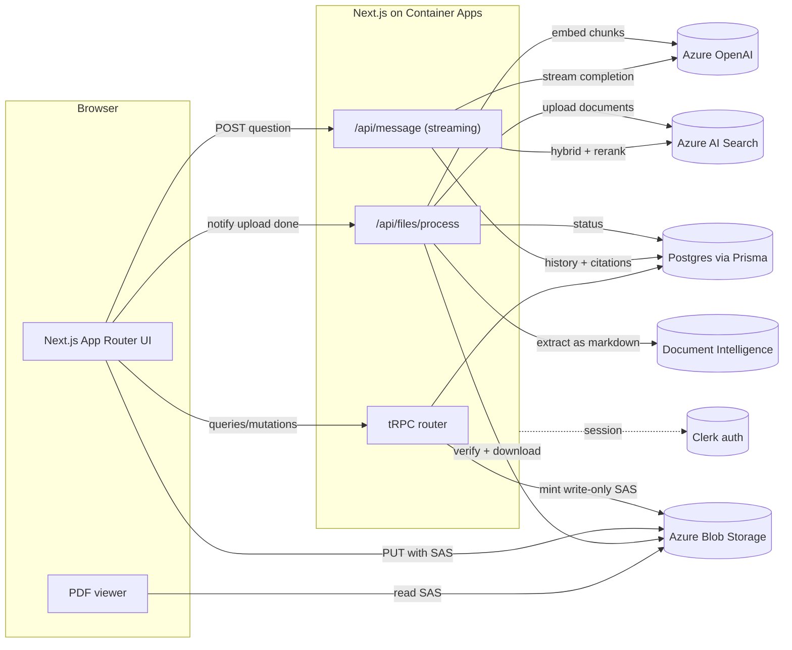

# PDF Chat

Upload a PDF and ask it questions. Answers are grounded in the document with retrieval-augmented generation (RAG), streamed token by token, and cite the pages they came from. Clicking a citation jumps the built-in viewer to that page.

Built end to end on Azure: AI Search for hybrid retrieval, Azure OpenAI for embeddings and generation, Document Intelligence for layout-aware extraction, Blob Storage for files, and Container Apps for hosting.

https://github.com/user-attachments/assets/01ec70c7-dfce-45f9-84ce-60e490db6bca

**[Live demo](https://pdf-chat.politeglacier-3cd2a0b8.westus.azurecontainerapps.io)** — hosted on Azure Container Apps. It scales to zero when idle, so the first request after a quiet period takes a few seconds to wake.

## Features

- **Grounded answers with citations.** Each reply shows the source pages it was built from. Clicking one navigates the PDF viewer.
- **Hybrid retrieval with reranking.** Keyword and vector search run together, their rankings are fused, and a semantic reranker orders the results.
- **Layout-aware extraction.** Tables stay tables and multi-column pages read in the right order, because extraction understands document structure rather than scraping a text layer.
- **Streaming responses.** Tokens render as they arrive, with optimistic updates so the conversation feels instant.
- **Per-user isolation.** Files upload to a private container through scoped, write-only credentials, and every retrieval is filtered to the owner.
- **Rate limiting.** Each user is capped at a configurable number of messages per window, since every question costs model tokens.
- **Clean lifecycle.** Deleting a document removes its indexed chunks, its stored file, and its message history.

## Architecture




## How it works

### Upload pipeline

1. The browser asks the server for an upload slot. The server picks the blob path, creates a `File` row in `PENDING` state, and returns a write-only SAS URL scoped to that one blob.
2. The browser uploads directly to Blob Storage over the REST API, reporting progress.
3. The client calls `/api/files/process` with the file ID. This claim is not trusted.
4. The server re-checks ownership, then confirms the blob exists and that its size and type are acceptable.
5. Document Intelligence analyses the PDF with the `prebuilt-layout` model and returns markdown. Page spans are sliced out so each page keeps its number.
6. Pages are split into 1000-character chunks with 200 characters of overlap, embedded with Azure OpenAI, and uploaded to the search index with `fileId` and `userId` fields.
7. The row is marked `SUCCESS`, or `FAILED` if any step throws. The client polls the status and shows the chat once ready.

### Question pipeline

1. The client `POST`s to `/api/message`. The handler validates the body, confirms the caller owns the file, and checks the rate limit.
2. The six most recent messages are loaded as history. This happens before the new question is inserted so it is not duplicated.
3. The question runs as a hybrid query: BM25 keyword scoring and vector similarity together, filtered to this file and user, then reordered by the semantic reranker.
4. The distinct page numbers behind the surviving chunks are sent back immediately in an `X-Source-Pages` header, ahead of the stream.
5. The excerpts go into the system prompt, prior turns are passed as real `user` and `assistant` messages, and the completion is streamed.
6. When the stream finishes, the assistant message is persisted along with its source pages.

## Design decisions

**Hybrid search rather than vectors alone.** Embeddings are weak on exact tokens: part numbers, surnames, statute references, anything where the literal string matters more than its meaning. Azure AI Search is a keyword engine that gained vector support, so it scores both and fuses the rankings, then a reranker model reorders the top candidates. This is a measurable retrieval improvement rather than a swapped dependency.

**Filters are mandatory in the retrieval signature.** The previous vector store gave each file its own namespace, so isolation was structural. Azure AI Search has no namespaces, and one index holds every user's chunks. Forgetting a namespace returns nothing, but forgetting a filter returns everyone's documents. `hybridSearch` therefore takes `fileId` and `userId` as required parameters rather than optional filter options, so the compiler enforces what was previously enforced by the storage layer. This is the one real regression in the move and it is worth naming.

**Layout-aware extraction.** Plain text extraction interleaves columns and flattens tables into unreadable runs of numbers, which is precisely the content people ask about. The `prebuilt-layout` model returns markdown, so the model sees a real table. The cost is about a cent per page past the free allowance, and it is the only cost here that scales with uploads rather than usage.

**The server names the blob, not the client.** An upload slot is a write-only credential for a single server-chosen path, valid for fifteen minutes. The browser cannot choose where its bytes land, overwrite another user's object, or read anything back. A SAS token cannot cap blob size, so size and content type are verified after upload and before any billable analysis.

**Client-notified processing with server verification.** Azure has no equivalent of a storage-provider upload callback. Event Grid would be more robust but is a substantial amount of infrastructure for this project. Instead the client reports that the upload finished, and the server treats that purely as a hint: it re-checks ownership and inspects the blob before doing work.

**Container Apps rather than serverless.** Analysing and embedding a long PDF can exceed a serverless execution limit, which is what forced the original processing to be awkward. A container has no such ceiling, so ingestion runs inline. Scale-to-zero means idle costs nothing.

**Rate limit backed by the database.** The messages table already records who sent what and when, so counting recent rows gives a limiter that works across instances with no extra infrastructure. The cost is one indexed count per request, negligible next to a model call. The tradeoff is a fixed window rather than a sliding one.

**Index definition lives in code.** `src/lib/azure/search.ts` holds the field, vector, and semantic configuration, and `npm run azure:setup` applies it. Clicking an index together in the portal leaves no reviewable artifact and cannot be recreated reliably.

## Security model

- Every tRPC procedure and route handler resolves the Clerk session server-side. Ownership is checked on every file access with a `where: { id, userId }` query, so users cannot reach each other's files by guessing IDs.
- Retrieval is filtered by both file and user on every query, enforced through the function signature.
- The blob container is private. Reads happen through short-lived signed URLs minted per page load; writes through single-blob, write-only URLs valid for fifteen minutes.
- Credentials fall back to `DefaultAzureCredential`, so production can run on managed identity with no stored secrets. The same code path works locally after `az login`.
- Request bodies are validated with Zod. Malformed input returns 400 rather than 500.

## Testing and CI

Unit tests run with Vitest and cover the parts most likely to break silently:

- **Chunking.** Page numbering, blank-page filtering, size limits, overlap, and metadata propagation.
- **Rate limiting.** Window boundaries and remaining-quota arithmetic.
- **Citation parsing.** Header round-trip including de-duplication and bad values.
- **tRPC router.** The auth guard, user upsert, cursor pagination, ownership checks, upload-slot creation, and delete cleanup including the failure path. Azure clients are mocked.

GitHub Actions runs typecheck, lint with zero warnings allowed, the test suite, and a Docker build on every push and pull request.

```bash
npm test
```

## Running locally

Prerequisites: Node 22, a Postgres database, a Clerk application, and the Azure resources from [AZURE_SETUP.md](AZURE_SETUP.md).

```bash
cp .env.example .env    # fill in the values
npm install
npm run azure:setup     # creates the blob container and search index
npx prisma db push      # creates the database tables
npm run dev
```

The app runs at `http://localhost:3000`. Uploads will fail until `http://localhost:3000` is in the storage account's CORS allowed origins, which is covered in the setup guide.

## Project structure

```
src/
  app/
    api/message/route.ts        streaming chat: hybrid retrieval, rate limit, citations
    api/files/process/route.ts  post-upload verification and ingestion trigger
    dashboard/[fileid]/         PDF viewer + chat, wrapped in the page-navigation provider
  components/
    chat/                       ChatContext (optimistic updates, streaming), Messages, Message
    PdfRenderer.tsx             react-pdf viewer, subscribes to citation clicks
    PdfPageContext.tsx          tiny event bus linking citations to the viewer
    UploadButton.tsx            direct-to-blob upload with progress
  lib/
    azure/
      credential.ts             managed identity with API key fallback
      blob.ts                   SAS minting, upload verification, lifecycle
      search.ts                 index definition, hybrid + semantic query, cleanup
      document-intelligence.ts  layout extraction to per-page markdown
      openai.ts                 chat model and embeddings by deployment name
    process-file.ts             the ingestion pipeline
    chunking.ts                 page documents and recursive character splitting
    rate-limit.ts               database-backed per-user limiter
  trpc/                         router, auth middleware, router tests
scripts/azure-setup.ts          creates the container and index
Dockerfile                      multi-stage build from Next.js standalone output
prisma/schema.prisma            User, File, Message with cascade and indexes
```


## Tech Stack

Next.js 16 (App Router) · React 19 · TypeScript · tRPC · React Query · Prisma 7 · Postgres · Clerk · Azure AI Search · Azure OpenAI · Azure AI Document Intelligence · Azure Blob Storage · Azure Container Apps · Vercel AI SDK · LangChain text splitters · Tailwind CSS 4 · shadcn/ui · Vitest · Docker
